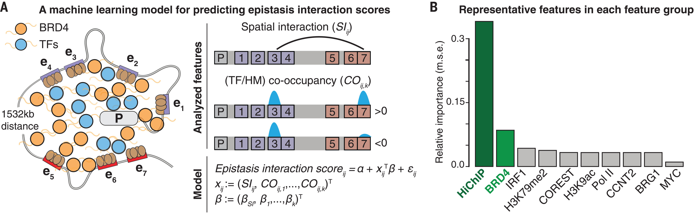

```{r render, eval=F, echo=F}
library(rmarkdown)
render("slides.rmd")
```

```{r setup, include=FALSE, cache=FALSE}
library(knitr)
knitr::opts_chunk$set(echo=F)
knitr::read_chunk('slides.r')
options(htmltools.dir.version = FALSE)
```

```{r papers, include=FALSE, cache=TRUE}
```

class: title-slide

.header[
```{r logo, results="asis"}
```
]

# `r rmarkdown::metadata$title`

.large[**`r rmarkdown::metadata$author`**]

.large[**`r rmarkdown::metadata$date`**]


---

layout: true

.footer[MRC Integrative Epidemiology Unit]

---

```{r ewas,results="asis"}
```

---

.running[enhancers]
## Redundancy to mutation is built into enhancers

`r papers["35951677","cite"]`

--

.pull-left-70[
</img>
]

--

### Background

*MYC* is regulated by **seven enhancers** split 
into **two clusters** 1.5Mb apart.

--

### Question

Which **pair** of enhancers has the biggest 
effect on *MYC* expression?

--

### Approach

Use **multiplexed CRISPRi** to knock out 
enhancer pairs.


---

.running[enhancers]

### Effects of enhancer pairs on *MYC* expression

.pull-left-70[
</img>
]

--

<br>
<br>
<br>
<br>
<br>
Heatmap shows **epistasis interaction scores**
for all enhancer pairs.

--

**epistasis interaction score**
~ effect of mutations in both 
enhancers on *MYC* expression

--

Notice how effect **increases** with pair distance.

---

.running[enhancers]
### Two-layer model hypothesis 

1. **Layer I** is additive, 
   i.e. expression decreases proportionally to the number of mutated enhancers

--

2. **Layer II** is synergistic, 
   i.e. mutations must occur in both enhancer clusters to 'knock out' *MYC*

--

.center[
</img>
]

---
.running[enhancers]

### Identifying a mechanism for two layers

Answer using **machine learning** (penalised regression):

--

- **features**: co-occurence of transcription factors, histone modifications 
and DNA-DNA spatial contacts (HiChIP) at enhancer pairs (from public datasets)

--

- **outcome**: 'epistatis interaction score' for enhancer pairs

--
.center[
</img>
]

---

.running[enhancers]

### Hypothesis based on machine learning model

A possible explanation for **synergy** between distant enhancers:

--

- one mutation reduces spatial contacts and *BRD4* colocalisation with *MYC* promoter

--

- one mutation *per* cluster required to prevent contacts and *BRD4*

--

.center[
</img>
]

---

.running[enhancers]

### Alternative hypothesis

> `r papers["36064783","cite"]`

--

The *MYC* promoter _switches_ between activating clusters.

--

.center[
</img>
]

---

.running[enhancers]

.pull-left-50[
### Question
Are enhancer pairs with high 'epistatis interaction scores' 
hotspots for disease-associated genetic variants?
]

--

.pull-left-50[
### Method
Machine learning model applied to GM12878 data
to predict 'epistatis interaction scores' (SRE) for enhancer pairs.
]

--

.pull-left-30[
<br><br><br>

Pairs with high prediction scores more likely 
to identify genetic variants associated with ALL relapse risk.
]

.pull-right-70[
</img>
]


---

.running[enhancers]

### Implications for omic studies?

--

- **Enrichment** Associations should be enriched in enhancers 
  with high 'epistatis interaction scores'

--

- **Imputation** If trait association observed in one enhancer, 
  then enhancers that interact should also have associations
  
--

- **Cell-type specificity** Cell-type-specific interaction scores can be 
  calculated from cell type reference data 
  (e.g. Blueprint). Trait association patterns could be tested for enrichment
  relative to cell-type-specific scores to hypothesize most relevant cell type. 

---
.running[review: big data]

`r papers["36064595","cite"]`

--

* Common data types, e.g. gene expression, DNA methylation

--

* Data repositories and platforms, e.g. TCGA, GEO

--

* Integrative analysis
  - across modalities, e.g. gene expression with DNA methylation
  - across cohorts
  - across resolutions, e.g. single-cell analysis uses bulk for 'zeros'
  
--

* Data for translational solutions
  - biomarkers in use, e.g. Oncotype DX for breast cancer
  - clinical studies using 'big data'
  - drug repurposing 

--

* Challenges
  - data availability
  - data-scale, e.g. ethnicity, rare diseases

---
.running[review: psychiatric genetics]

`r papers["36138228","cite"]`	
<!-- Ten challenges for clinical translation in psychiatric genetics.-->

--
<br>
<br>

</img>

Possibly missing: reduce diagnosis noise?

---
.running[review: lung cancer prediction]

`r papers["36153611","cite"]`	

--

<br>
<br>

Review of

--

* various liquid biopsies available

--

* how DNA methylation is/could be measured

--

* what is known relative to lung cancer detection and prognosis

--

<br>
*A bit boring but good place to look up "what's known".*

---
.running[dexamethasone exposure score]

## DNAm score for glucocorticoid exposure

`r papers["36127421","cite"]`

.pull-left-60[
<div style="padding: 5px">
</img>
</div>
]

--

<br>
**Dexamethasone** is a glucocorticoid medication
for a wide variety of diseases and health conditions.

It has **anti-inflammatory** and **immunosuppressant** effects.

--

<span style="color:#dfb286; font-weight: bold">
CellDMC identifies 2621 neutrophil-specific associations, 
only one in other cell types.
</span>

--

<span style="color:#b8d786; font-weight: bold">
Elastic net was applied to neutrophil-specific sites
to construct the neutrophil dexamethasone methylation index (NDMI).
</span>

---

.running[dexamethasone exposure score]

### NDMI performance in independent data

.center[
</img>
]

---
.running[dexamethasone exposure score]

### NDMI performance purified cell types 

**Note:** data generated from subset of training population

.center[
</img>
]

---
.running[dexamethasone exposure score]

### NDMI and glioma survival 

.center[
</img>
]

--

**Note:** associations remain after 
adjusting for dexamethasone exposure, 
cell counts, age, etc.

---

## Announcements

* [Epigenetic Epidemiology short course](https://www.bristol.ac.uk/medical-school/study/short-courses/2021-22-courses/epigenetic-epidemiology/)
  8 - 10 May 2023

* [Advanced Epigenetic Epidemiology short course](https://www.bristol.ac.uk/medical-school/study/short-courses/2021-22-courses/epigenetic-epidemiology/)
  18 - 19 May 2023
