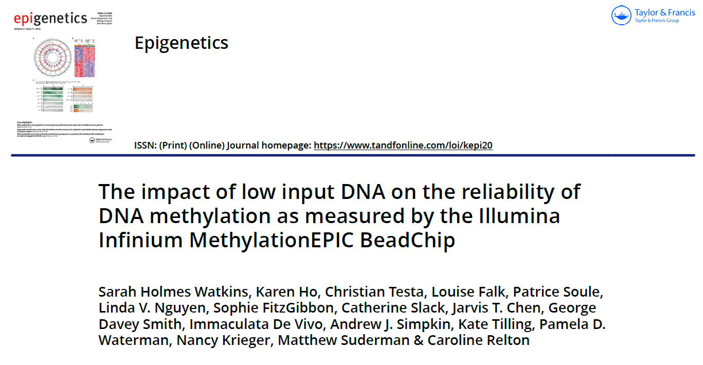
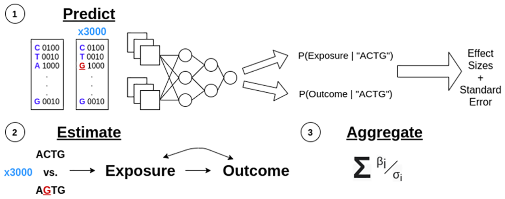
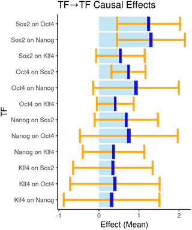
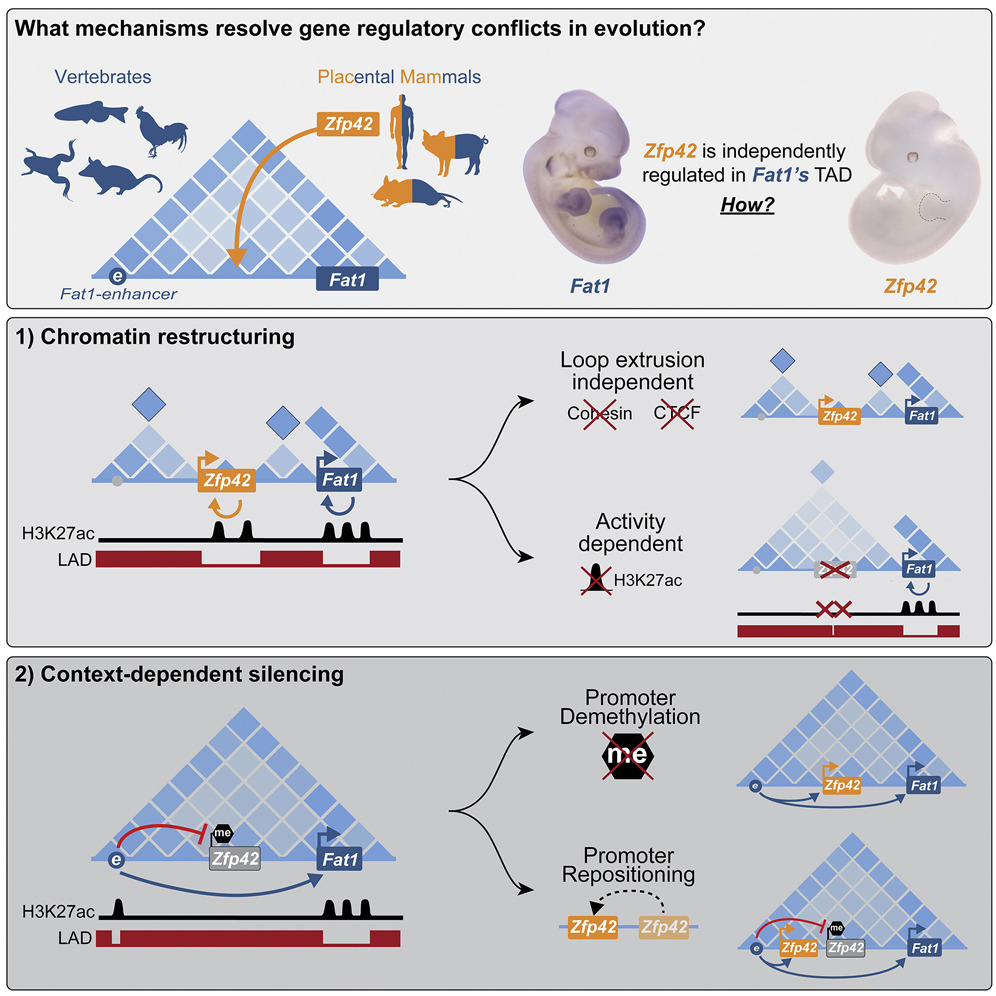
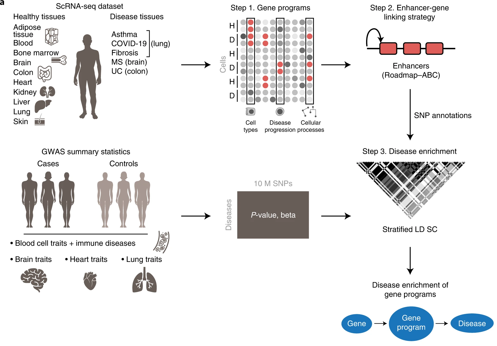
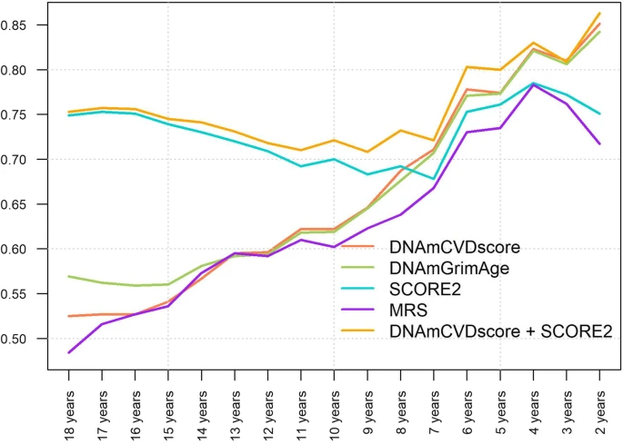

```{r render, eval=F, echo=F}
library(rmarkdown)
render("slides.rmd")
```

```{r setup, include=FALSE, cache=FALSE}
library(knitr)
knitr::opts_chunk$set(echo=F)
knitr::read_chunk('slides.r')
options(htmltools.dir.version = FALSE)
```

```{r papers, include=FALSE, cache=TRUE}
```

class: title-slide

.header[
```{r logo, results="asis"}
```
]

# `r rmarkdown::metadata$title`

.large[**`r rmarkdown::metadata$author`**]

.large[**`r rmarkdown::metadata$date`**]


---

layout: true

.footer[MRC Integrative Epidemiology Unit]

---

```{r ewas,results="asis"}
```

---

</img>

---

.running[DeepMR]

## Deep Mendelian randomization

`r papers["36265006","cite"]`

**Background** 

Machine learning methods have been used to predict 
regulatory 'marks' on DNA and RNA, e.g.
transcription factor binding sites, DNA methylation levels, 
histone modifications, RNA splicing, etc.

--

**Question**: Can we use these models to evaluate causal relationships between marks?

--

**DeepMR** 

--

Input: 

- *locus* - genomic region of interest
- *exposure* - a regulatory mark, e.g. TF
- *outcome* - another regulatory mark, e.g. another TF
- *model* - calculates probability of a mark appearing at a given DNA sequence,
  `P(mark | sequence)`

--

Output: causal effects estimated using MR

---
.running[DeepmR]

**Steps:**

1.&nbsp; Prepare instruments

--

&nbsp;&nbsp;1a.&nbsp; Select random sequences from the *locus* ("reference sequences")

--

&nbsp;&nbsp;1b.&nbsp; Mutate references with all possible single point mutations 
  (e.g. ACGA has mutations 
  **T**CGA, **G**CGA, **C**CGA, A**T**GA, A**G**GA, A**C**CGA, ...)

--

&nbsp;&nbsp;1c.&nbsp; Calculate binding probabilities
  `P(exposure | sequence)` and `P(outcome | sequence)`

--

&nbsp;&nbsp;Each mutant/reference pair defines an instrument.
   
--

&nbsp;&nbsp;1d.&nbsp; Effect of instrument on the exposure
  = `P(exposure | mutant) - P(exposure | reference)`
      
--

&nbsp;&nbsp;1e.&nbsp; Effect of instrument on the outcome
  = `P(outcome | mutant) - P(outcome | reference)`

--

&nbsp;&nbsp;1f.&nbsp; Omit instruments with small effects.

--

2.&nbsp; Estimate effect of exposure on the outcome by applying MR to the instruments

--

3.&nbsp; Estimate overall effect of exposure on the outcome by applying random effects
   meta-analysis.

---

.running[DeepmR]

The three steps visually:

1.&nbsp; Prepare instruments

2.&nbsp; Estimate effect of exposure on the outcome by applying MR to the instruments

3.&nbsp; Estimate overall effect of exposure on the outcome by applying random effects
   meta-analysis.

</img>

---

.running[DeepmR]

Using TF cooperativity analysis, 
[others](https://dx.doi.org/10.1038/s41588-021-00782-6)
have provided evidence that *Oct4* and *Sox2* binding 
influences the binding of *Nanog* and *Klf4*,
and that *Oct4* and *Sox2* "act on each other via a composite motif".

DeepMR estimates largely agree:

.center[
</img>
]

---

.running[regulation]

## How gene programs evolve

`r papers["36179666","cite"]`

**Question** 

1. How are gene expression programs maintained when new genes 
   emerge in evolution?

2. How is it possible for most topologically associated domains (TADs) to contain 
   multiple independently expressed genes?

--

**Example** 

*Zfp42* is expressed specifically in the placenta of mammals.

However, it is located in the *Fat1* TAD
which is expressed in multiple mammalian tissues.

It first emerged in vertebrates.

---

.running[regulation]

.pull-left-30[
**Results**

1) In ESCs, *Zfp42* is regulated by different enhancers than *Fat1*
due to chromatin activity.

2) In embryonic limbs, *Zfp42* is inactive and does not respond to *Fat1* enhancers
due to DNA methylation.
]

.pull-right-70[
</img>
]

---

.running[cell type]

`r papers["36175791","cite"]`	

.pull-left-40[
**Question** Given a disease-associated genetic variant, 
in which cell type does it confer disease?

**Solution** `sc-linker`

**Results**

- γ-aminobutyric acid-ergic neurons linked to major depressive disorder
- a disease-dependent M-cell program to ulcerative colitis 
- a disease-specific complement cascade process to multiple sclerosis
- disease-dependent immune cell-type programs in autoimmune disease
]

.pull-right-60[
**`sc-linker`** infers cell type by integrating 
- single-cell RNA-sequencing (11 tissues), 
- epigenomic SNP-to-gene maps and 
- genome-wide association study summary statistics (60 diseases)

1. *Construct gene programs* from scRNA. Gene programs are latent 
   factors that differentiate cell types from one another.

2. *Link SNPs to programs* by linking them to program genes
   using Roadmap Enhancer-Gene Linking
   and Activity-by-Contact (CRISPR perturbations)
   
3. *Evaluate enrichment* of GWAS SNPs in a program using sLDSR
]

---

.running[cell type]

</img>

---

.running[prediction]

`r papers["36175966","cite"]`	

**Dataset** EPIC Italy cohort (n=1803, 295 CVD events)

**DNAmCVDscore** derived to predict time-to-CVD event from 60 DNAm surrogates
  (including for BMI, blood pressure, fasting glucose and insulin, cholesterol, 
  triglycerides, coagulation biomarkers, Gadd episcores, DNAm clocks, 
  Grimage components, cell counts, lead)

</img>

---

## Announcements

* [Epigenetic Epidemiology short course](https://www.bristol.ac.uk/medical-school/study/short-courses/2021-22-courses/epigenetic-epidemiology/)
  8 - 10 May 2023

* [Advanced Epigenetic Epidemiology short course](https://www.bristol.ac.uk/medical-school/study/short-courses/2021-22-courses/epigenetic-epidemiology/)
  18 - 19 May 2023
