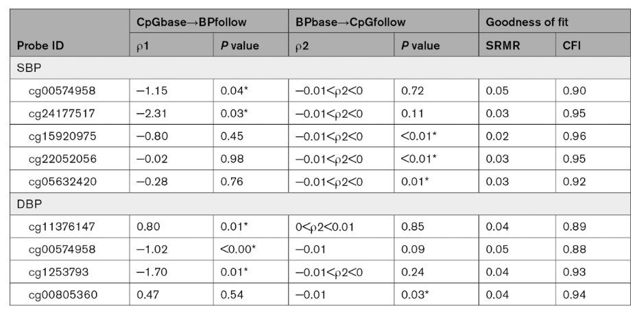
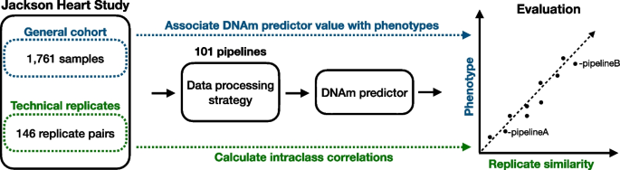
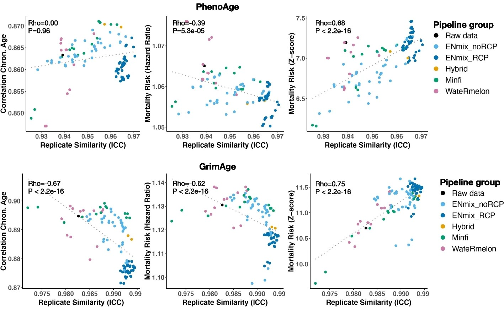
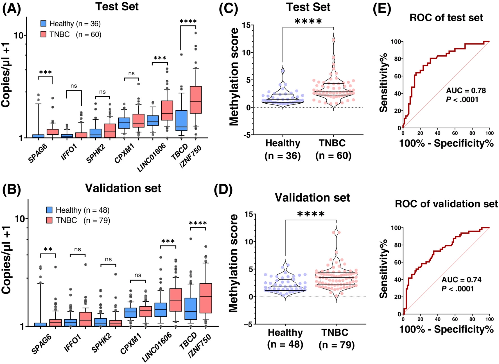
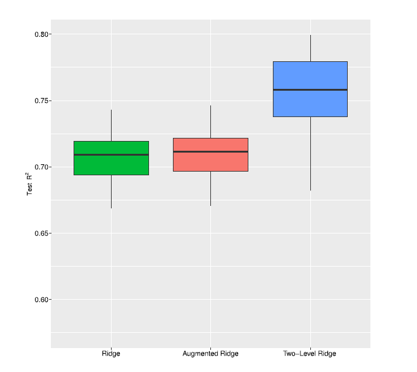

```{r render, eval=F, echo=F}
library(rmarkdown)
render("slides.rmd")
```

```{r setup, include=FALSE, cache=FALSE}
library(knitr)
knitr::opts_chunk$set(echo=F,warning=F,message=F)
knitr::read_chunk('slides.r')
options(htmltools.dir.version = FALSE)
```

```{r papers, include=FALSE, cache=TRUE}
```

class: title-slide

.header[
```{r logo, results="asis"}
```
]

# `r rmarkdown::metadata$title`

.large[**`r rmarkdown::metadata$author`**]

.large[**`r rmarkdown::metadata$date`**]


---

layout: true

.footer[MRC Integrative Epidemiology Unit]

---

## EWAS

```{r,results="asis"}
ewas <- read.csv("ewas.csv")
cols <- c("pmid", "journal", "variable", "tissue", "population", "results")

half <- floor(nrow(ewas)/2)

writeLines(c(
  ".striped[",
  kable(ewas[1:half,cols], row.names=F),
  "]"))

```

---

## EWAS, cont.

```{r,results="asis"}
writeLines(c(
  ".striped[",
  kable(ewas[(half+1):nrow(ewas),cols], row.names=F),
  "]"))
```

 
---

.running[Prediction]

## CpG sites predict blood pressure in 5 years

`r papers["36345830","cite"]`
 
16 CpG sites associated with systolic BP; 20 with diastolic BP

Cross-lagged analysis indicates predictive ability:
 
</img>
 
 

---

.running[Prediction]

## Predictors affected by preprocessing

`r papers["36280888","cite"]`

</img>

* "32 out of 41 predictors (78%) demonstrate excellent consistency" 
* "moderate correlation in performance across analytical strategies (mean rho = 0.40, SD = 0.27)"
* recommend "OOB background correction, RELIC dye-bias correction, quantile normalization applied separately for methylated and unmethylated intensities of Infinium I and II probes, and RCP to correct for probe design type bias."

---

.running[Prediction]




*... but mortality risk by hazard ratio positively associated with technical noise?*

---


.running[Prediction]

## Detecting breast cancer from cell-free DNAm

`r papers["36305646","cite"]`

1. Identify 6 top DMRs between tumor and normal breast tissue
2. Droplet digital PCR applied to cell-free DNA from blood plasma
   (test: 60 cases, 36 controls; validation: 79 cases, 48 controls)

</img>

---

.running[Prediction]

## Including prior information when building models

`r papers["36274755","cite"]`
 
We'd often like to use previous knowledge to generate better models, e.g. 
genes regulated by CpG sites, pathways with genes regulated by CpG sites.


.pull-left[
**Ridge regression**

$$min_{\beta} ||y-X\beta||_2^2 + \lambda||\beta||_2^2$$

where 
* $y$ is the variable of interest, 
* $X$ is the methylation matrix, 
* $\beta$ is the model coefficients for each CpG site
]

.pull-right[
**Hierarchical ridge regression**

$$min_{\beta,\gamma} ||y-X\beta||_2^2 + \lambda_1||\beta-Z\gamma||_2^2 + \lambda_2||\gamma||_2^2$$
where 

* $Z$ describes added information, <br>e.g. identify CpG sites linked to a gene, 
  effect sizes from a related EWAS
  
In other words, we shrink $\beta$ toward prior information and $\gamma$ to 0. 
If the prior information is not useful, then hierarchical ridge regression 
reduces to ridge regression. 
]

---

.running[Prediction]

There is an R package on CRAN.
```{r,echo=T,eval=F}
install.packages("xrnet")
```

```{r,echo=T}
library(xrnet)
```

To illustrate, we'll use their example dataset with 200 samples, 
50 features and 5 external features.
We split it into 80% for training and 20% for testing.
```{r,echo=T,results="none"}
data(GaussianExample) 
is.train <- sample(c(F,T), length(y_linear), prob=c(0.2,0.8), replace=T)
```
Here is how to the hierarchical model using cross-validation 
to optimize $\lambda_1$ and $\lambda_2$.
```{r,echo=T,eval=F}
model <- tune_xrnet(
  x = x_linear[is.train,], ## 50 features for 200 samples
  y = y_linear[is.train],  ## variable of interest for 200 samples
  external = ext_linear,   ## 5 external features for 50 features (50x5)
  family = "gaussian",   ## outcome variable is numerical
  penalty_main = define_penalty(0),    ## ridge for features 
  penalty_external = define_penalty(1) ## lasso for external features
)
```

```{r,echo=T,eval=F}
model$opt_penalty      ## lambda_1
model$opt_penalty_ext  ## lambda_2
```

Predictions are made as usual:
```{r,echo=T,eval=F}
pred <- predict(model, newdata=x_linear[!is.train,], type="response")
```

---

.running[Prediction]

.pull-left-30[
For fun, I've plotted model performance for different proportions
of samples being set aside for training. The 'base' is just 
normal ridge regression.

Notice:
* Performance improves with training set proportion
* The hierarchical model tends to perform better
]

.pull-right-70[
```{r,echo=F,cache=T}
rlapply <- function(...) do.call(rbind, lapply(...))
set.seed(20221114)
ret <- rlapply(seq(0.1,0.9,0.1), function(prop) {
   rlapply(1:10, function(i) {
     is.train <- sample(c(F,T), length(y_linear), prob=c(1-prop,prop), replace=T)
     model0 <- tune_xrnet(
       x = x_linear[is.train,], 
       y = y_linear[is.train],   
       family = "gaussian",   
       penalty_main = define_penalty(0)    
     )
     pred0 <- predict(model0, newdata=x_linear[!is.train,], type="response")
     model <- tune_xrnet(
       x = x_linear[is.train,], ## 50 features 
       y = y_linear[is.train],  ## variable of interest 
       external = ext_linear,   ## 5 external features for 50 features (50x5)
       family = "gaussian",   ## outcome variable is numerical
         penalty_main = define_penalty(0),    ## ridge 
       penalty_external = define_penalty(1) ## lasso
     )
     pred <- predict(model, newdata=x_linear[!is.train,], type="response")
     c(prop=prop,
         r0=cor(pred0, y_linear[!is.train],use="p"),
       r1=cor(pred,y_linear[!is.train],use="p"))
  }) 
})
ret <- rbind(
  data.frame(model="base",prop=ret[,"prop"],r=ret[,"r0"]),
  data.frame(model="hierarchical",prop=ret[,"prop"],r=ret[,"r1"]))
ret <- na.omit(ret)
library(ggplot2)
ggplot(data=ret, mapping=aes(x=as.character(prop), y=r, fill=factor(model))) + 
  geom_boxplot() + 
  xlab("proportion training") + 
  ylab("performance (R)")
```
]

---

.running[Prediction]

.pull-left-30[

The authors trained age predictors in a dataset with 656 samples.

External features $Z$ for hierarchical ridge regression linked CpG sites to 
genes. In other words, a CpG site would be more likely to play an important
role in the model if other sites for the gene were chosen to play important 
roles.

'Augmented ridge regression' is ridge regression applied to the matrix
$[X,XZ]$ rather than just $X$.

]

.pull-left-70[
</img>
]


---

.running[Prediction]

## Matched buccal and brain DNAm

`r papers["36320053","cite"]`

> "In this study, we performed a correlation analysis between DNAm data of a total of n=120 matched post-mortem buccal and prefrontal cortex samples. We identified nearly 25,000 (3% of approximately 730,000) cytosine-phosphate-guanine (CpG) sites showing significant (false discovery rate q < 0.05) correlations between buccal and PFC samples."
 
> "The DNAm raw data generated and used for the analyses described in this manuscript are available to qualified researchers and qualified research projects."
 
They replicate findings in 
https://www.ncbi.nlm.nih.gov/geo/query/acc.cgi?acc=GSE111165
(blood, saliva, buccal, **live** brain from 27 epilepsy patients)
 
 
---

.running[Prediction]

## Matched brain, blood, saliva and buccal DNAm

`r papers["36270064","cite"]`

> "Methods: The four tissue types (brain, blood, saliva, buccal) of DNA samples from up to 40 patients, including 11 POD cases, were analyzed using Illumina EPIC array. DNAm differences between patients with and without POD were examined. We also conducted enrichment analysis based on the top DNAm signals."

> "Results: The most different CpG site between control and POD was found at cg16526133 near the ADAMTS9 gene from the brain tissue(p = 8.66E-08). However, there are no CpG sites to reach the genome-wide significant level."

> "The data that support the findings of this study are available from the corresponding author, G.S., upon reasonable request."


---

.running[Epigenetics]

## CpG density and age-associated DNAm

`r papers["36253871","cite"]`

Data
* longitudinal DNA methylation from 600 aged between 67-80

Results
* 182,760 loci change with age
* strongest changes 8322 low CpG density loci
* change at 1487 of these affected by cis SNPs
* in younger individuals, change at these sites is less variable and mostly loss of methylation


